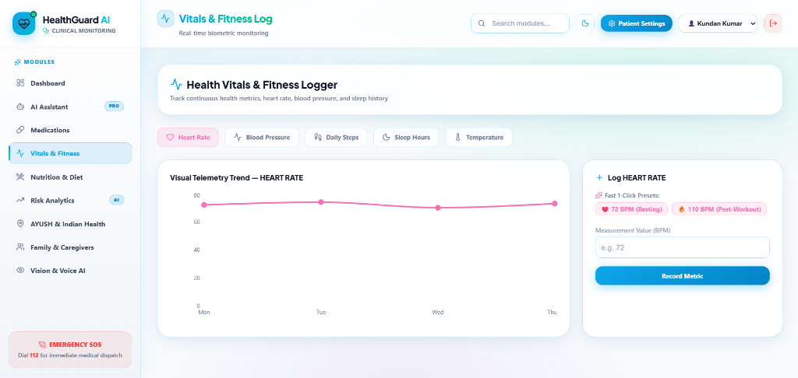
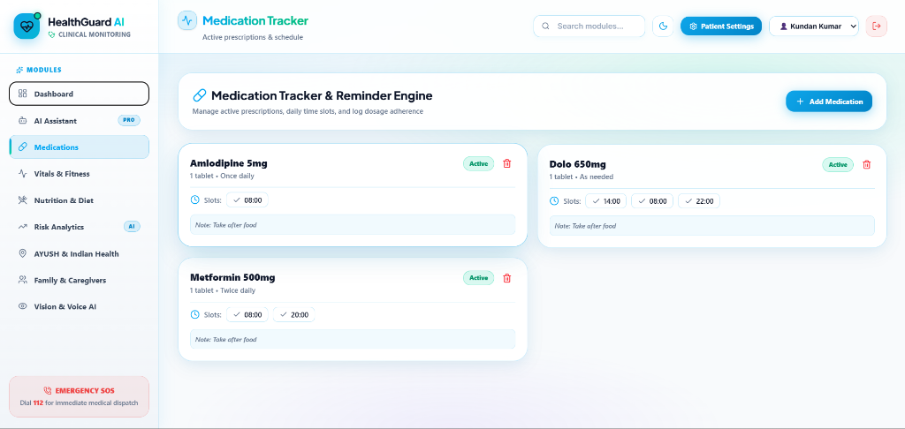
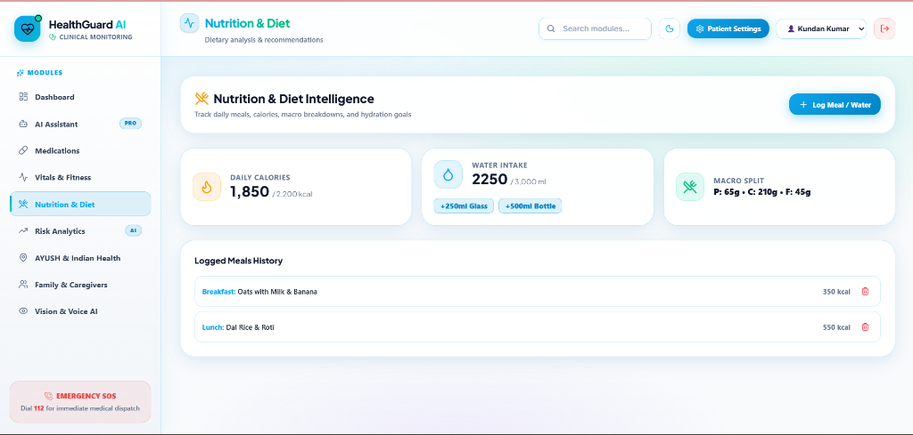
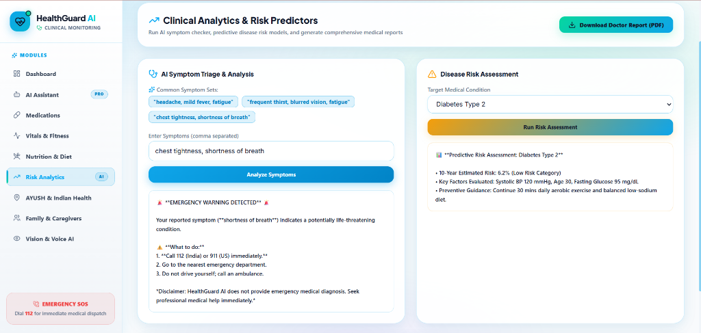
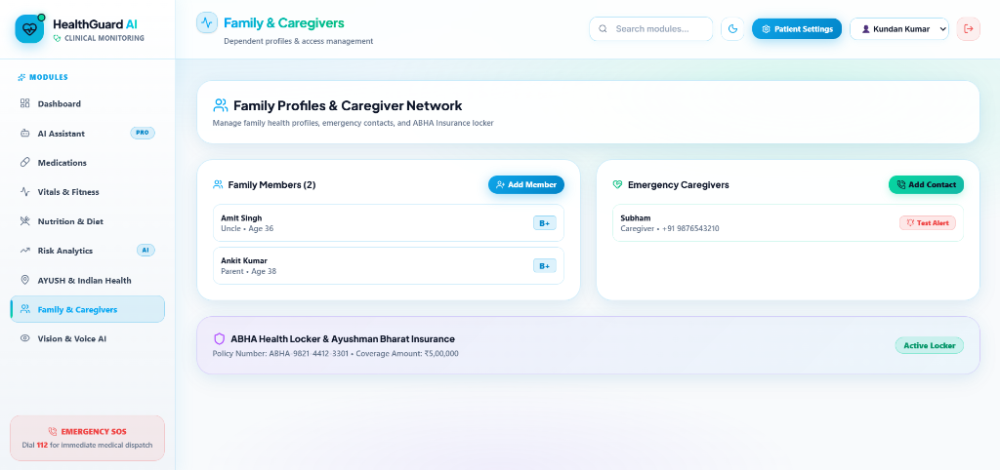
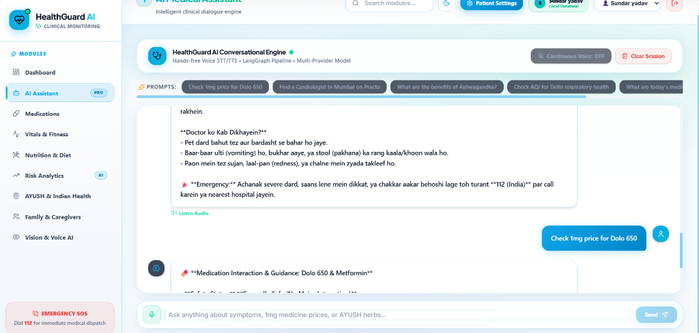

<p align="center">
  
</p>

<h1 align="center">🏥 HealthGuard AI</h1>
<h3 align="center">Next-Gen Intelligent Personal Health Monitoring & AI Clinical Assistant</h3>

<p align="center">
  <a href="https://healthguard-ai.vercel.app" target="_blank">
    
  </a>
  <a href="https://healthguard-ai-backend.onrender.com/docs" target="_blank">
    
  </a>
  <a href="https://github.com/ankitpal85/HealthGuard-AI" target="_blank">
    
  </a>
</p>

<p align="center">
  
  
  
  
  
  
  
  
</p>

<p align="center">
  <b>AI-Powered Health Telemetry • Smart Drug Interaction Checker • LangGraph Stateful Pipeline<br/>
  1mg & AYUSH Indian Health Integration • Hands-Free Voice/Vision AI • ABHA Insurance Locker</b>
</p>

---

## 🔗 🌐 Live Demo Links

| Service | Host | Live Production Link |
| :--- | :--- | :--- |
| 🖥️ **React Web Application** | **Vercel** | [https://healthguard-ai.vercel.app](https://healthguard-ai.vercel.app) |
| 📡 **FastAPI Production Server** | **Render** | [https://healthguard-ai-backend.onrender.com](https://healthguard-ai-backend.onrender.com) |
| 📄 **Interactive Swagger API Docs** | **Render** | [https://healthguard-ai-backend.onrender.com/docs](https://healthguard-ai-backend.onrender.com/docs) |

---

## 🌟 Overview & Product Vision

**HealthGuard AI** is a state-of-the-art, end-to-end intelligent medical telemetry and clinical diagnostic assistant. Powered by a **LangGraph stateful multi-agent pipeline** and powered by **Google Gemini 2.5 & OpenAI GPT-4 models**, HealthGuard AI bridges the gap between daily biometric logging and actionable clinical intelligence.

Key capabilities include **real-time vital trend analytics**, **drug-drug interaction auditing**, **AI symptom triaging with automated escalation**, **1mg Indian medicine price lookup**, **Ayurvedic remedy curation**, and **ABHA health locker management**.

> ⚠️ **Clinical Notice**: HealthGuard AI provides clinical information and telemetry monitoring for educational/informational purposes. It is not a replacement for professional emergency care or doctor consultation.

---

## 🎨 Feature Modules & Interface Showcase

### 1. 📈 Vitals & Biometric Fitness Logger
Real-time tracking of continuous biometric markers (Heart Rate, Blood Pressure, Daily Steps, Sleep Duration, Body Temperature). Features interactive **Recharts telemetry visualization**, 7-day trend analysis, and instant 1-click preset metric logging.

<p align="center">
  
</p>

---

### 2. 💊 Medication Tracker & Adherence Engine
Manage active prescriptions with customizable daily time slots (e.g. 08:00, 14:00, 22:00). Includes automated dosage background alarms, 7-day adherence scoring (85%+ optimal goal), and safety drug interaction auditing.

<p align="center">
  
</p>

---

### 3. 🥗 Nutrition, Macro & Hydration Intelligence
Log daily meal intake with automatic calorie and macronutrient breakdown (Protein, Carbohydrates, Fat). Features water intake tracking with quick +250ml / +500ml logging buttons and dietary history logs.

<p align="center">
  
</p>

---

### 4. 🔬 AI Clinical Risk Analytics & Emergency Triage
AI-powered symptom triaging engine that detects life-threatening emergency warnings (e.g., chest tightness, acute shortness of breath) and triggers immediate emergency SOS guidance (Dial 112 / 911). Includes 10-year predictive risk calculators for Type 2 Diabetes and Cardiovascular conditions.

<p align="center">
  
</p>

---

### 5. 👨‍👩‍👧‍👦 Family Profiles & Caregiver Network
Manage multi-dependent family health profiles, emergency caregiver contact networks with 1-click test alert dispatch, and secure digital **ABHA (Ayushman Bharat Health Account)** health insurance locker integration.

<p align="center">
  
</p>

---

### 6. 💬 AI Health Assistant & Voice Engine
Multi-turn conversational dialogue engine with **Server-Sent Events (SSE) token streaming**, hands-free Web Speech API STT/TTS voice consultation, and quick-prompt suggestions.

<p align="center">
  
</p>

---

## 🏗️ System Architecture & Stateful Agent Pipeline

HealthGuard AI operates on a stateful **LangGraph pipeline** with dynamic tool routing, fallback resiliency, and SSE streaming:

```text
┌───────────────────────────────────────────────────────────────────────────┐
│                       React 19 + TypeScript + Vite                        │
│                (Vercel Production UI — TailwindCSS 4)                     │
└─────────────────────────────────────┬─────────────────────────────────────┘
                                      │ REST API + SSE Token Streaming
                                      ▼
┌───────────────────────────────────────────────────────────────────────────┐
│                    FastAPI Server (Render Production)                     │
│  ┌─────────────────────────────────────────────────────────────────────┐  │
│  │                    LangGraph Stateful Agent                         │  │
│  │              (Emergency Triage → LLM Tool Router)                   │  │
│  └──────┬────────────┬────────────┬────────────┬────────────┬──────────┘  │
│         │            │            │            │            │             │
│  ┌──────┴──────┐ ┌───┴──────┐ ┌───┴──────┐ ┌───┴──────┐ ┌───┴──────────┐  │
│  │ Clinical    │ │ 1mg &    │ │ Vitals & │ │ Vision & │ │ Medical      │  │
│  │ Tools       │ │ AYUSH    │ │ Meds DB  │ │ Voice AI │ │ PubMed       │  │
│  │ • Triage    │ │ • 1mg    │ │ (SQLite) │ │ • Vision │ │ Research     │  │
│  │ • Risk Eval │ │ • AYUSH  │ │ • Users  │ │ • STT    │ │ • NCBI API   │  │
│  │ • Interaction││ • Practo │ │ • Logs   │ │ • TTS    │ │ • Citations  │  │
│  └─────────────┘ └──────────┘ └──────────┘ └──────────┘ └──────────────┘  │
└─────────────────────────────────────┬─────────────────────────────────────┘
                                      │
                                      ▼
                   ┌──────────────────────────────────────┐
                   │        LLM Resiliency Pool           │
                   │  • Gemini 2.5 Flash (Primary)         │
                   │  • Gemini Key2 (Automatic Fallback)   │
                   │  • OpenAI GPT-4 / 3.5 (Secondary)     │
                   └──────────────────────────────────────┘
```

---

## 🛠️ Technology Stack

| Layer | Technology |
| :--- | :--- |
| **Frontend Framework** | React 19, TypeScript 6.0, Vite 8 |
| **Styling & Design** | TailwindCSS 4, Lucide Icons, Plus Jakarta Sans & Inter Fonts |
| **Data Visualization** | Recharts (Responsive Line & Bar Charts) |
| **Backend Server** | Python 3.10+, FastAPI 0.110+, Uvicorn |
| **AI Agent Framework** | LangChain, LangGraph (Stateful Graph Execution) |
| **LLM Models** | Google Gemini 2.5 Flash (Dual-Key Pool), OpenAI GPT-4 |
| **Database & Auth** | SQLite 3, Salted SHA-256 Auth, Firebase Web API |
| **Medical APIs** | 1mg Medicine Search, AYUSH Herb DB, Practo Doctors API, PubMed NCBI |
| **Hosting & DevOps** | Vercel (Frontend), Render (Backend Service), GitHub Actions |

---

## 🚀 Local Development Setup

### 1. Clone & Install Dependencies
```bash
git clone https://github.com/ankitpal85/HealthGuard-AI.git
cd "HealthGuard-AI"
```

### 2. Configure Environment Variables
Copy `.env.example` to `.env`:
```bash
cp .env.example .env
```
Fill in your API keys in `.env`:
```env
GOOGLE_API_KEY=your_gemini_api_key_here
GOOGLE_API_KEY2=your_secondary_gemini_key_here
OPENAI_API_KEY=your_openai_api_key_here
LLM_PROVIDER=gemini
```

### 3. Backend Setup
```bash
python -m venv venv
# Windows:
venv\Scripts\activate
# Linux/macOS:
source venv/bin/activate

pip install -r requirements.txt
python -m uvicorn backend.main:app --port 8000 --reload
```

### 4. Frontend Setup
```bash
cd frontend
npm install
npm run dev
```

### 5. Quick 1-Click Windows Launcher
Simply run:
```cmd
.\start.bat
```

---

## 🤝 Project Contributors & Team Members

This project was built with dedication and teamwork by:

<table align="center">
  <tr>
    <td align="center" width="200">
      <a href="https://github.com/ankitpal85">
        <br />
        <sub><b>Ankit Kumar Pal</b></sub>
      </a><br />
      💻 Lead Developer & AI Engineer
    </td>
    <td align="center" width="200">
      <a href="https://github.com/amitpal200">
        <br />
        <sub><b>Amit Pal</b></sub>
      </a><br />
      🛠️ Backend & System Architecture
    </td>
    <td align="center" width="200">
      <a href="#">
        <br />
        <sub><b>Binam Pal</b></sub>
      </a><br />
      📊 Data Analytics & Testing
    </td>
    <td align="center" width="200">
      <a href="#">
        <br />
        <sub><b>Aashish Shah</b></sub>
      </a><br />
      🎨 UI/UX & Frontend Integration
    </td>
  </tr>
</table>

---

<p align="center">
  <b>Built with ❤️ for Health Tech Innovation</b><br/>
  <sub>If you find HealthGuard AI useful, please consider giving us a ⭐ on <a href="https://github.com/ankitpal85/HealthGuard-AI">GitHub</a>!</sub>
</p>
